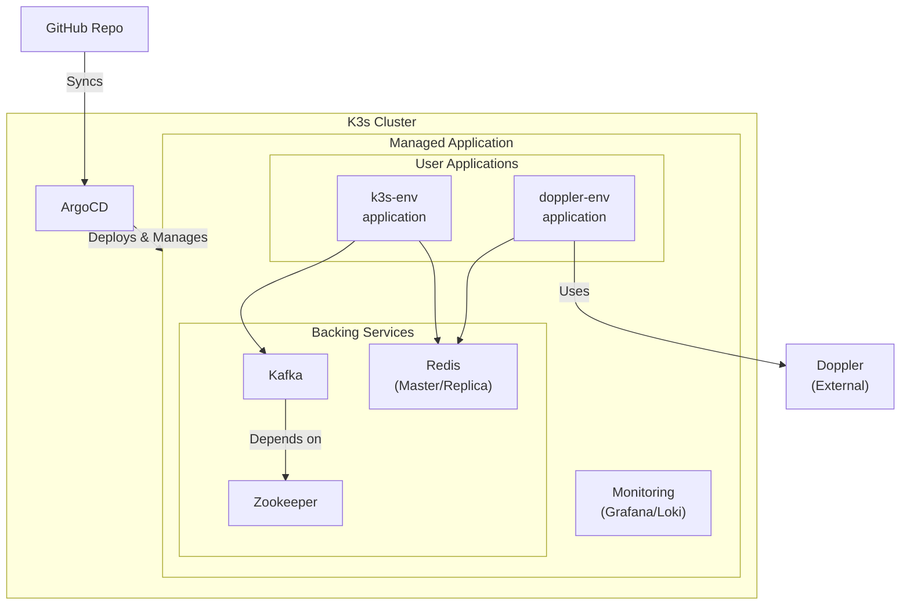

# public-k3s

이 저장소는 N100 Mini PC와 같은 저사양 홈서버 환경에서 k3s 클러스터를 운영하기 위한 GitOps 구성 예제입니다. 
ArgoCD를 사용하여 애플리케이션을 관리하며, 개발 및 학습 목적으로 구성하였습니다.

## 애플리케이션에 배당된 Resource에 대한 설명

여기에 구성된 모든 애플리케이션의 리소스(CPU, Memory)는 아래 명시된 최소 사양의 홈서버 환경에 맞춰져 있습니다.  
실제 운영(Production) 환경에서 사용하기에는 매우 부족하며, 안정성을 보장할 수 없습니다.

운영 환경에서 사용하고자 할 경우, 각 애플리케이션의 `resources` 설정을(예: `deployment.yaml`) 수정해주세요.

### 기준 하드웨어 사양

*   **CPU**: Intel N100
*   **RAM**: 16GB
*   **SSD**: 512GB

---

## 아키텍처

이 저장소는 ArgoCD를 사용하여 GitHub 저장소의 변경사항을 감지하고, K3s 클러스터에 애플리케이션을 자동으로 배포 및 동기화하는 GitOps 워크플로우를 따릅니다.



*   **Kubernetes**: K3s
*   **GitOps**: ArgoCD
*   **Deployed Applications**:
    *   `ArgoCD`
    *   `Monitoring` (Grafana & Loki)
    *   `Zookeeper` & `Kafka`
    *   `Redis` (Master & Replica)
    *   `k3s-env-application`
    *   `doppler-env-application`

---

## 📁 디렉토리 구조

```
public-k3s/
└── app/
    ├── _manifests/       # K3s 클러스터 초기 설정
    ├── argocd/           # ArgoCD 애플리케이션 및 App-of-Apps 패턴 정의
    ├── doppler-env-application/ # Doppler 연동 샘플 앱
    ├── k3s-env-application/   # 일반 샘플 앱
    ├── kafka/            # Kafka 메시지 브로커
    ├── monitoring/       # Grafana 모니터링
    ├── redis/            # Redis 캐시/저장소
    ├── script/           # 유틸리티 스크립트
    └── zookeeper/        # Zookeeper (Kafka 의존성)
```

---
